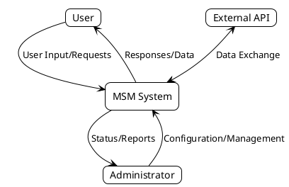
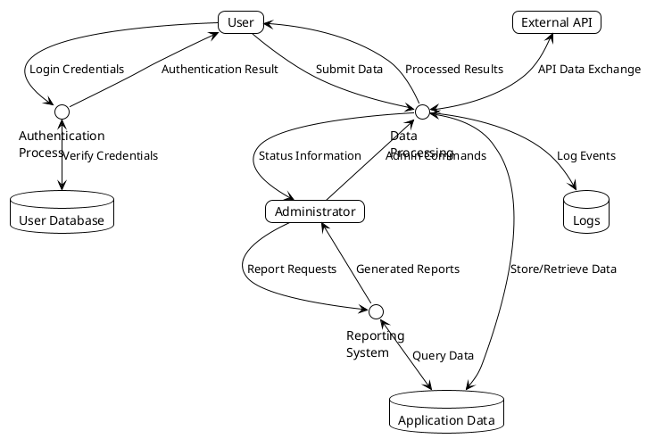

# Data Flow Diagram (DFD)

This document provides a Data Flow Diagram for the MSM project.

## Overview

A Data Flow Diagram visually represents how data moves through the system, including processes, data stores, external entities, and data flows.

## Level 0 DFD (Context Diagram)



## Level 1 DFD



## How to Use

1. Install PlantUML (https://plantuml.com/starting)
2. Use a PlantUML compatible editor or plugin (VS Code has plugins)
3. Generate the diagrams from the code blocks above
4. Customize the diagrams to match your specific project architecture

## Customizing the DFD

To customize this DFD for your specific project:

1. Identify all external entities (users, systems that interact with yours)
2. List all processes in your application
3. Document all data stores (databases, files)
4. Map the data flows between entities, processes, and data stores
5. Update the PlantUML code accordingly

## Notes

- Level 0 provides a high-level context view
- Level 1 breaks down the main processes and data flows
- Additional levels can be created to show more detail for complex subsystems
```

## Maintaining the DFD

Update this diagram when making significant architectural changes to ensure documentation remains accurate.
